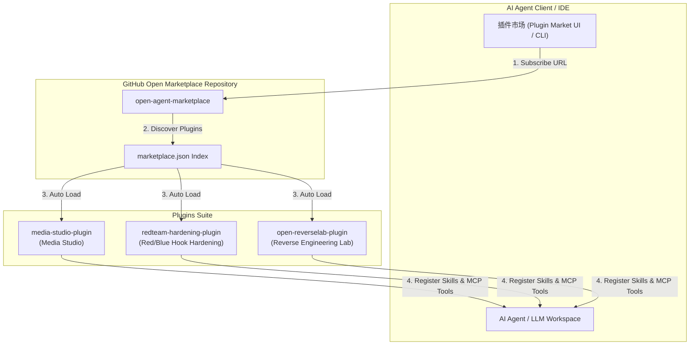

<div align="center">

# 🚀 Open Agent Marketplace

**Universal Plugin Marketplace & MCP Extension Hub for AI Agents**

[](LICENSE)
[](https://modelcontextprotocol.io/)
[](https://github.com/lingxiaoyiyu-hub/open-agent-marketplace)
[](CONTRIBUTING.md)

[English Overview](#-english-overview) • [插件目录](#-插件与技能目录) • [安装与订阅指南](#-安装与订阅指南) • [安全说明](#-安全与脱敏规范)

</div>

---

## 📖 简介 / Introduction

**Open Agent Marketplace** 是专为各类 **AI Agent 框架** 与 **MCP（Model Context Protocol）客户端** 打造的开放型扩展插件市场集中库。本项目汇集了多模态 AI、网络安全与红蓝攻防加固、二进制与移动端逆向工程等领域的多款 Agent 原生扩展套件。

无论是 IDE 插件界面、命令行 Agent 还是自定义 LLM 工作流，均可通过本仓库订阅并动态载入 **Skills（技能）**、**MCP Servers（模型上下文协议服务）** 及 **Rules（规则范式）**。

---

## 🏗️ 架构设计 / Architecture



---

## 📦 插件与技能目录 / Plugin Catalog

| 插件标识 (Plugin ID) | 显示名称 (Display Name) | 核心技能 (Skills Exposed) | 提供能力 / MCP 工具 | 状态 |
| :--- | :--- | :--- | :--- | :---: |
| **`media-studio-plugin`** | Media Studio 多模态媒体创作套件 | `media-studio` | • TTS 语音合成<br>• 音色克隆<br>• 语音转写 (ASR) 与字幕<br>• 视频混剪/粗剪/转码<br>• 文生图与图像编辑<br>• 视频理解 | `Active` |
| **`redteam-hardening-plugin`** | 红蓝 Hook 攻防加固套件 | `redteam-hook` | • 软件黑盒二进制分析探针<br>• Hook 攻击 PoC 还原<br>• 蓝队反 Hook / Syscall 加固方案<br>• Bypass 对抗防护报告生成 | `Active` |
| **`open-reverselab-plugin`** | 逆向工程实验室套件 | `reverselab-pe`<br>`reverselab-apk`<br>`reverselab-ctf` | • Windows PE / ELF 静态与动态调试<br>• Android DEX / JNI / Frida 脱壳分析<br>• CTF 竞赛与 Crackme 自动化解题<br>• 密码学算法提取与 197+ 知识库 | `Active` |

---

## 🚀 安装与订阅指南 / Installation & Setup

### 方法一：通过 IDE 插件市场弹窗订阅（推荐）

1. 打开支持插件市场的 IDE / 客户端设置界面。
2. 点击 **“添加插件市场 (Add Plugin Market)”**。
3. 在弹出的输入框中填入本仓库的 GitHub 链接：
   ```text
   https://github.com/lingxiaoyiyu-hub/open-agent-marketplace
   ```
4. 点击 **“+ 添加插件市场”** 确认。系统将自动解析 `marketplace.json` 索引并同步载入全部插件与技能。

### 方法二：Git CLI 手动克隆至本地插件目录

```bash
# 进入本地 Agent 插件配置目录
cd ~/.gemini/config/plugins/

# 克隆仓库
git clone https://github.com/lingxiaoyiyu-hub/open-agent-marketplace.git custom-marketplace
```

---

## ⚙️ 环境变量与密钥配置 / Environment Setup

为了保障安全性，本仓库所有插件均已进行**脱敏处理**，代码及配置文件中无任何硬编码 API Key。使用特定插件功能前，请在系统本地配置相应的环境变量：

### Media Studio 插件环境变量
在调用 Media Studio 的语音合成、语音转写、字幕、视频剪辑、文生图或视频分析功能前设置：

- **Windows PowerShell**:
  ```powershell
  $env:STUDIO_API_KEY="your_actual_api_key"
  ```
- **Linux / macOS (Bash/Zsh)**:
  ```bash
  export STUDIO_API_KEY="your_actual_api_key"
  ```

---

## 🔒 安全与脱敏规范 / Security & Privacy

- **零密钥泄漏保证**：本仓库推送到 GitHub 的所有配置文件（如 `mcp_config.json`）均已剔除敏感凭证。
- **本地环境隔离**：所有密钥均仅在运行阶段从宿主机的环境变量注入，插件不收集、不上传任何私密令牌。
- **安全审计**：详见 [SECURITY.md](SECURITY.md)。

---

## 🤝 贡献与反馈 / Contributing

欢迎贡献新的插件、技能或改进已有工具！请阅读 [CONTRIBUTING.md](CONTRIBUTING.md) 了解代码规范与 PR 提交流程。

---

## 📄 开源协议 / License

本项目采用 [MIT License](LICENSE) 开源协议。
