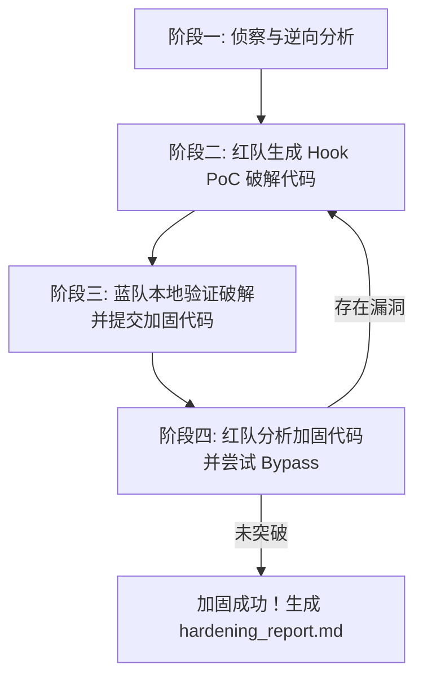

# Red Team Hook Exploitation & Binary Hardening Protocol (红蓝 Hook 攻防对抗协议)

本技能用于为开发者提供**真实代码级、黑盒逆向视角**的 Hook 攻击还原与软件防御加固。

---

## ⚠️ 合法性前置检查 (Mandatory)

**在开始任何攻击前，必须先确认:**
1. 目标软件是用户自己开发的，或用户已获得书面授权。
2. 不得对第三方商业软件进行破解，即使以"学习"或"加固"为名。
3. 如果无法确认所有权，先询问用户:"这个软件是你自己开发的，还是已获授权测试的?"

---

## 🎯 交互角色定义

1. **红队（AI 兼任）**：
   - 扮演专业的二进制逆向工程与 Exploit 开发者。
   - 在**无源码/黑盒视角**或仅有伪代码的前提下，查找敏感 API/导出表/地址，编写**可直接运行的 Hook 破解代码（Frida JS 脚本、MinHook C++ 代码、Memory Patch 汇编）**。
2. **蓝队（用户兼任）**：
   - 扮演软件开发者/防御方。
   - 在本地真实运行红队提供的 Hook 代码，验证破解效果，并使用防御手段重构加固代码。

---

## 🔄 攻防演练四步流程 (The 4-Phase Loop)

### Phase 1: 侦察与逆向分析 (Reconnaissance)
* **如果用户提供了二进制文件 (`.exe` / `.dll` / `.so`)**：
  - 运行插件探针脚本 `python scripts/analyze_binary.py <file_path>` 提取真实 PE/ELF 导入导出表、节区熵、缓解措施 (ASLR/DEP/CFG)、加壳启发、敏感 API 与 Hook 候选目标。
  - 加 `--json` 获取结构化输出，便于后续自动化处理。
* **如果用户提供了 IDA/Ghidra 反汇编片段或函数签名**：
  - 识别关键控制流分支（如 `JE/JNE` 比较）、验证函数返回值（如 `RAX/EAX` 寄存器）、敏感 API 调用（如 `WinVerifyTrust`, `GetVolumeInformationW`）。
* **如果是 PyInstaller 打包的 Python 程序**：
  - 用 `pyinstxtractor-ng` 拆包，反编译 `.pyc` 找授权校验逻辑。

### Phase 2: 红队 Hook PoC 生成 (Red Team Exploitation)
红队**必须输出可运行的代码**，不得仅给出口头建议：
1. **Frida 动态插桩**：输出 `Interceptor.attach` / `Memory.protect` / 篡改返回值的 JS 脚本。
2. **MinHook / Detours 注入**：输出完整 C++ 钩子函数与 `MH_CreateHook` 呼叫。
3. **Memory Patch (内存篡改)**：输出将关键判断分支修改为 `0x90 0x90 (NOP)` 或 `0xB0 0x01 0xC3 (MOV AL, 1; RET)` 的补丁代码。
4. **Python 运行时插桩**：对 Python 打包程序，输出 `monkeypatch` / 函数替换 / 字节码补丁。

### Phase 3: 蓝队验证与防御提交 (Blue Team Defense)
提示用户在本地运行该 PoC，确认成功破解后，指导蓝队采用以下技术加固：
- 详见同目录参考库 `references/anti_hook_guide.md`
- **代码段 Hash/CRC32 校验**（检测 `.text` 段 Inline Hook）
- **Direct Syscall 直调**（绕过 Ring3 API 拦截）
- **Anti-Frida / 命名管道与动态库加载检测**
- **VTable 虚函数指针只读校验**
- **PyInstaller 程序专项加固**（Cython 编译、license 加密、服务端验证）

### Phase 4: 红队 Bypass 评估 (Bypass Attempt)
针对蓝队提交的新代码：
1. 评估是否有办法绕过（例如：CRC 校验是否可以通过 Hook `VirtualProtect` 绕过；反调试是否可以通过 Patch 寄存器绕过）。
2. 如果能绕过，输出 **2.0 版 Bypass Hook 代码**；如果无法绕过，正式宣布加固成功，并按 `references/hardening_report_template.md` 模板输出 `hardening_report.md`。

---

## 🛠️ 随附工具与参考

- **分析探针**：`scripts/analyze_binary.py`（PE/ELF 真实解析，支持 `--json`）
  - 依赖：`pip install pefile pyelftools`
- **防御代码库**：`references/anti_hook_guide.md`（C++ 反 Hook 实战代码，含 5 层防御）
- **报告模板**：`references/hardening_report_template.md`