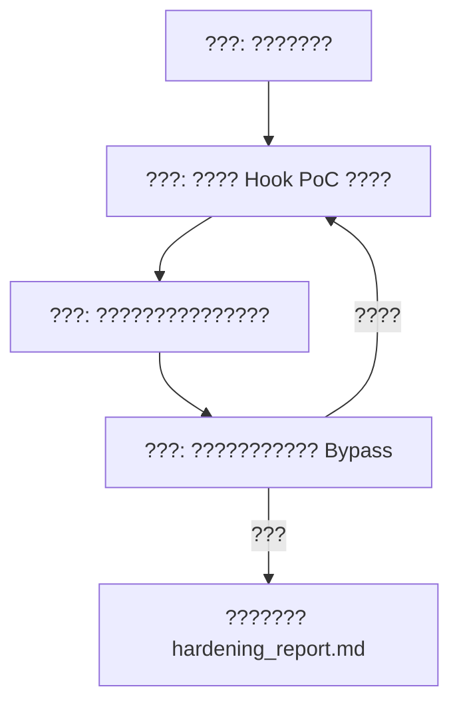

# Red Team Hook Exploitation & Binary Hardening Protocol (?? Hook ??????)

???????????**????????????**? Hook ????????????

---

## ?? ??????? (Mandatory)

**??????????????:**
1. ????????????????????????
2. ??????????????????"??"?"??"???
3. ???????????????:"??????????????????????"

---

## ?? ??????

1. **???AI ???**?
   - ????????????? Exploit ????
   - ?**???/????**??????????????? API/???/?????**?????? Hook ?????Frida JS ???MinHook C++ ???Memory Patch ???**?
2. **????????**?
   - ???????/????
   - ???????????? Hook ????????????????????????

---

## ?? ???????? (The 4-Phase Loop)

### Phase 1: ??????? (Reconnaissance)
* **???????????? (`.exe` / `.dll` / `.so`)**?
  - ???????? `python scripts/analyze_binary.py <file_path>` ???? PE/ELF ?????????????? (ASLR/DEP/CFG)???????? API ? Hook ?????
  - ? `--json` ??????????????????
* **??????? IDA/Ghidra ??????????**?
  - ??????????? `JE/JNE` ????????????? `RAX/EAX` ??????? API ???? `WinVerifyTrust`, `GetVolumeInformationW`??
* **??? PyInstaller ??? Python ??**?
  - ? `pyinstxtractor-ng` ?????? `.pyc` ????????

### Phase 2: ?? Hook PoC ?? (Red Team Exploitation)
??**??????????**???????????
1. **Frida ????**??? `Interceptor.attach` / `Memory.protect` / ?????? JS ???
2. **MinHook / Detours ??**????? C++ ????? `MH_CreateHook` ???
3. **Memory Patch (????)**????????????? `0x90 0x90 (NOP)` ? `0xB0 0x01 0xC3 (MOV AL, 1; RET)` ??????
4. **Python ?????**?? Python ??????? `monkeypatch` / ???? / ??????

### Phase 3: ????????? (Blue Team Defense)
?????????? PoC??????????????????????
- ???????? `references/anti_hook_guide.md`
- **??? Hash/CRC32 ??**??? `.text` ? Inline Hook?
- **Direct Syscall ??**??? Ring3 API ???
- **Anti-Frida / ????????????**
- **VTable ?????????**
- **PyInstaller ??????**?Cython ???license ?????????

### Phase 4: ?? Bypass ?? (Bypass Attempt)
???????????
1. ?????????????CRC ???????? Hook `VirtualProtect` ???????????? Patch ???????
2. ???????? **2.0 ? Bypass Hook ??**??????????????????? `references/hardening_report_template.md` ???? `hardening_report.md`?

---

## ??? ???????

- **????**?`scripts/analyze_binary.py`?PE/ELF ??????? `--json`?
  - ???`pip install pefile pyelftools`
- **?????**?`references/anti_hook_guide.md`?C++ ? Hook ?????? 5 ????
- **????**?`references/hardening_report_template.md`
